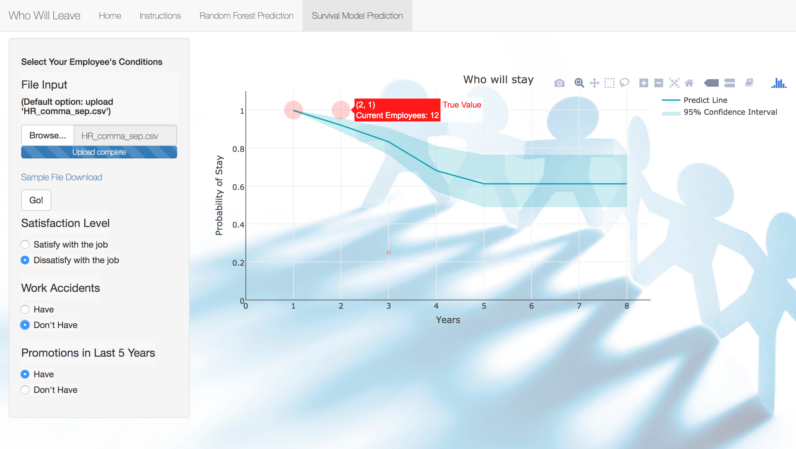

# ADS Project 5: Who will leave next? ---Human Resources Advisory Report


Term: Spring 2017

+ Team #4
+ Team members
	+ Yuan Mei (Presenter)
	+ Yingxin Zhang
	+ Kexin Nie
	+ Xuanzi Xu
	+ Senyao Han
	+ He Zhu
+ Project summary: In our project,we use human resources data provided on Kaggle to analyze that under different scenarios how likely an employee will leave in the following years. We use five models: For the Cox Regression model in survival analysis, we forecast the leaving probability in the next few years. For the Random Forest model, Logistic Regression model, Decision Tree model, Naive Bayes model, we predict the current state(leave/stay) of an employee given different conditions. We develope an RShiny app for users to explore our models and form a report to give our analysis explicitly.

[Main Report](https://github.com/TZstatsADS/Spr2017-proj5-grp4/blob/master/doc/main.pdf)

[ShinyApp link](https://ads-yz3032.shinyapps.io/who_will_leave/)
	
**Contribution statement**: ([default](doc/a_note_on_contributions.md)) All team members contributed equally in all stages of this project. All team members approve our work presented in this GitHub repository including this contributions statement. 
	

Following [suggestions](http://nicercode.github.io/blog/2013-04-05-projects/) by [RICH FITZJOHN](http://nicercode.github.io/about/#Team) (@richfitz). This folder is orgarnized as follows.

```
proj/
├── lib/
├── data/
├── doc/
├── figs/
└── output/
```

Please see each subfolder for a README file.
