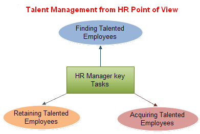
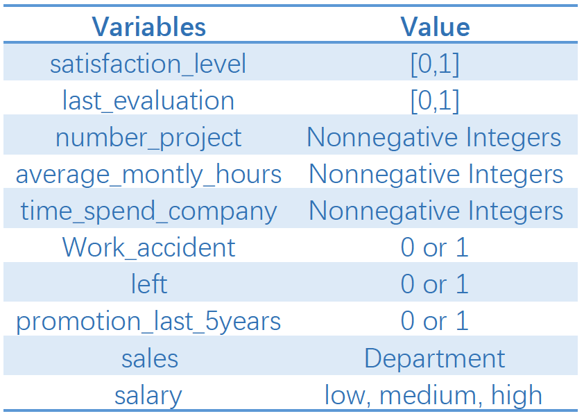

#Introduction  

The purpose of our project is to make a prediction engine of employees' future decision(Whether they will leave the company) for the company. It's crucial to the company because: first, human resource department need to use the number of staff quiting to determine the new year recruitment plan; second, they also need to find out the factors behind the staff losing to develop better company mechanic to retain the old talents.


Our project contains two parts: first is our shiny app(a handy tool for the company);second is our main documents showing the calculation and comparision between Cox Model(Survival Analysis), Decision Tree, Naive Bayes, Random Forest, and Logistic Regression.

The data our models based on is the human resource data from Kaggle. Our data set contains information for 14999 employees, which include their income, satifaction of the current company and whether have promotion, etc. The data set also provides their current status(left or not).


```{r setup, include=FALSE}
knitr::opts_chunk$set(echo = TRUE)
```

```{r,echo=FALSE}

# load package
#if (!require("corrplot")) install.packages('corrplot')
#if (!require("survival")) install.packages('survival')
#if (!require("survminer")) install.packages('survminer')

library(corrplot)
library(dplyr) 
#library(rattle)
library(survival)
library(survminer)
library(ggplot2)
library(reshape2)
library(caret)
library(rpart)
library(rpart.plot)
library(tidyr)
library(ggvis)
library(DT)
library(e1071)
library(rminer)
library("ROCR")
```

#Step1 Processing Data 
###Import data
```{r,echo=FALSE}
setwd("~/Documents/GitHub/Spr2017-proj5-grp4/data")
hr <- as.data.frame(read.csv("HR_comma_sep.csv") )
```

###Exploratory data analysis

Since we need categorical data when using Survival analysis model, we split the continous vairables(satisfaction_level,last_evaluation,average_monthly_hours into) into different categories according to the distribution.As we can see in the plots, these three indicaters are nearly uniformly distributed.As for "satisfaction_level",the staff tends to stay when satisfaction level<0.5;the staff tends to leave when satisfaction level>0.5; So we use quantile(0.5) to split the data.As for "last evaluation", the staff's behaviors can be grouped into three groups."last evaluation" <0.6, 0.6<"last evaluation" <0.8,0.8 < last evaluation".As for "average_montly_hours", the staff's behaviors can be grouped into three groups."average_montly_hours"<160, 160<"last evaluation" < 240, 240 < last evaluation".

```{r}

plot(ecdf(hr$satisfaction_level))
plot(ecdf(hr$last_evaluation))
plot(ecdf(hr$average_montly_hours))
```


```{r}
hr$left <- factor(hr$left)
ggplot(hr, aes(satisfaction_level)) + 
  geom_density(aes(group = left, fill = left), alpha = 0.5) + 
  theme_bw() + xlab("Satisfaction Level") + ylab("Density") + 
  ggtitle("Density of Satisfaction Level")
```


```{r}
ggplot(hr, aes(last_evaluation)) + 
  geom_density(aes(group = left, fill = left), alpha = 0.5) + 
  theme_bw() + xlab("last evaluation") + ylab("Density") + 
  ggtitle("Density of last evaluation")
```


```{r,echo=FALSE}
ggplot(hr, aes(average_montly_hours)) + 
  geom_density(aes(group = left, fill = left), alpha = 0.5) + 
  theme_bw() + xlab("average_montly_hours") + ylab("Density") + 
  ggtitle("Density of average_montly_hours")
```

###Generate Dataframe
```{r}
#0 is not satisfied 1: very very happy
satisfy<-rep(0,nrow(hr))
satisfy[hr$satisfaction_level>= 0.5]<- 1
hr$satisfy<-satisfy

# 0 is low evaluation; 1 is medium evaluation; 2 is high evaluation.
evaluate<-rep(0,nrow(hr))
evaluate[hr$last_evaluation>= 0.6 & hr$last_evaluation<= 0.8]<- 1
evaluate[hr$last_evaluation > 0.8] <-2
hr$evaluate<-evaluate

# 0 is spending low average monthly hours; 1 is spending medium average monthly hours; 2 is spending high average monthly hours.
monthly.hours<-rep(0,nrow(hr))
monthly.hours[hr$average_montly_hours>= 160 & hr$average_montly_hours<= 240]<- 1
monthly.hours[hr$average_montly_hours > 240] <-2
hr$monthly.hours<-monthly.hours

# Work accident
hr$Work_accident<-ifelse(as.logical(hr$Work_accident), 1, 0)
```

### Correlation plot

As we can see from the correlation plot, the variables "Satify","Promotion_last_5years","Work_accident" is highly correlated staff status "left". So we choose these indicators as our feartures.
```{r}
M<-hr[,c(-9,-10)]
M$left<-as.numeric(M$left)
M<-M[,c(-1,-2,-4)]
M<-cor(M)
corrplot( M ,is.corr = FALSE, type = "full", order = "hclust", 
         tl.col = "black", tl.srt = 30)

```

#Step 2 Survival Analysis
Due to the information provided in our data set, we decide to use a Cox Proportional Hazard Model to predict the future performance. Because the left column represents the current status of an employee, we also know the time they left and the employement time if they still work in the company. We believe the cox model will work will on this kind of data.

**A brief Introduction of Cox Model**

The purpose of the model is to evaluate simultaneously the effect of several factors on survival. In other words, it allows us to examine how specified factors influence the rate of a particular event happening (e.g., infection, death) at a particular point in time. This rate is commonly referred as the hazard rate. Predictor variables (or factors) are usually termed covariates in the survival-analysis literature.

The Cox model is expressed by the hazard function denoted by h(t). Briefly, the hazard function can be interpreted as the risk of dying at time t. It can be estimated as follow:

**h(t)=h0(t)?exp(b1x1+b2x2+...+bpxp)**

where,

t represents the survival time

h(t) is the hazard function determined by a set of p covariates (x1,x2,...,xpx1,x2,...,xp)
the coefficients (b1,b2,...,bpb1,b2,...,bp) measure the impact (i.e., the effect size) of covariates.
the term h0(t) is called the baseline hazard. It corresponds to the value of the hazard if all the xixi are equal to zero (the quantity exp(0) equals 1). The 't' in h(t) reminds us that the hazard may vary over time.
The Cox model can be written as a multiple linear regression of the logarithm of the hazard on the variables xixi, with the baseline hazard being an 'intercept' term that varies with time.

The quantities exp(bi)exp(bi) are called hazard ratios (HR). A value of bibi greater than zero, or equivalently a hazard ratio greater than one, indicates that as the value of the ithith covariate increases, the event hazard increases and thus the length of survival decreases.

Put another way, a hazard ratio above 1 indicates a covariate that is positively associated with the event probability, and thus negatively associated with the length of survival.

In summary,

 * HR = 1: No effect
 
 * HR < 1: Reduction in the hazard

 * HR > 1: Increase in Hazard

Our main results are in Survival Rates at t, which is exp(-Integral of HR from 0 to t)

The first plot is for our full model, the total survival rates over years for all the data. We look at the summary and find the model z value is significant.
```{r}
#we first need to group some non-level variables
#cox model: our full model
hr$left<-as.numeric(hr$left)
hr.cox <- coxph(Surv(time_spend_company, left) ~
                  satisfy+promotion_last_5years+Work_accident, data = hr)

#baseline values
ggsurvplot(survfit(hr.cox), color = "#2E9FDF",
           ggtheme = theme_minimal(),main="Survival Probability Plot for the full Cox Model")
```

**Evaluation of Cox Model**

We took a look at the summary of our full model. R-square is really low compared to a regular regression model. However it is pretty usual for a real-life cox model. We also looked at the p-values for our chosen variables, and all of them have significant p-values. Also there are results for three different tests, they are also significant. (Even though we observe a 0 for p-values, it is really just close to zero). In conclusion, we believe this model is significant.
```{r}
summary(hr.cox)
```


**Application I:Then we take a look at the effect of individual variables**
```{r}
#Visualization for different variables
#example: satisfy+promotion_last_5years+Work_accident
fit<-survfit(Surv(time_spend_company, left) ~ satisfy, data = hr)
ggsurvplot(fit,ggtheme = theme_minimal())
fit1<-survfit(Surv(time_spend_company, left) ~ promotion_last_5years, data = hr)
ggsurvplot(fit1,ggtheme = theme_minimal())
fit2<-survfit(Surv(time_spend_company, left) ~ Work_accident, data = hr)
ggsurvplot(fit2,ggtheme = theme_minimal())

```

**Application II:We can also use the model to predict the future action of employees. The following is the prediction for two made-up employees**
```{r}
# predict new data  
new <- with(hr,
               data.frame(satisfy=c(0.9,0.8), Work_accident=c(1,0), promotion_last_5years=c(0,1))
               )
#predicted values
fit1<-survfit(hr.cox, newdata = new)
predict<-data.frame(fit1$surv)
predict$time<-1:8

#convert the dataframe to long format
predict_long<-melt(predict, id = "time")
ggplot(data=predict_long, aes(x=time, y=value, colour=variable))+
  geom_line()+
  ggtitle("Prediction Plot for the action of employees in the future") +
  labs(x="Year",y="Probability of a person staying in the same company")
```

#Step3 More Prediction Models
## Cross-Validation
we split the data randomly into training set using 5-fold-cross-validation
```{r}
# Set the target variable as a factor
hr$left <- as.factor(hr$left)
## install.packages("caret") 
library("caret")
# cross-validation
train_control<- trainControl(method="cv", number=5, repeats=3)
head(train_control)
```

## Decision tree
General idea of decision tree is,using a tree-like graph or model of decisions and their possible consequences(The status of the employee). 
```{r, warning=F, fig.width=10}
# train the model 
rpartmodel<- train(left~., data=hr, trControl=train_control, method="rpart")
# make predictions
predictions<- predict(rpartmodel,hr)
hr_model_tree<- cbind(hr,predictions)
# summarize results
confusionMatrix<- confusionMatrix(hr_model_tree$predictions,hr_model_tree$left)
confusionMatrix

rpart.plot(rpartmodel$finalModel, type = 2, fallen.leaves = F, cex = 0.8, extra = 2)
#fancyRpartPlot(rpartmodel$finalModel)

library("ROCR")
hr_model_tree$predictions <- as.numeric(paste(hr_model_tree$predictions))
# 
perf.obj <- prediction(predictions=hr_model_tree$predictions, labels=hr_model_tree$left)
# # Get data for ROC curve
roc.obj1 <- performance(perf.obj, measure="tpr", x.measure="fpr")
plot(roc.obj1,
     main="Cross-Sell - ROC Curves",
     xlab="1 - Specificity: False Positive Rate",
     ylab="Sensitivity: True Positive Rate",
    col="blue")
abline(0,1,col="grey")

```

## Random Forest
The idea outperform decision tree by constructing multiple decision trees, and classify the new object down each of the trees in the forest. The forest chooses the classifacation having the most votes from the trees.
```{r}
# train the model 
randomforestModel<- train(left~., data=hr, trControl=train_control, ntree=30,method="rf")
# make predictions
predictions<- predict(randomforestModel,hr)
hr_model_randomforest<- cbind(hr,predictions)
# summarize results
confusionMatrix<- confusionMatrix(hr_model_randomforest$predictions,hr_model_randomforest$left)
confusionMatrix

library("ROCR")
hr_model_randomforest$predictions <- as.numeric(paste(hr_model_randomforest$predictions))
# 
perf.obj <- prediction(predictions=hr_model_randomforest$predictions, labels=hr_model_randomforest$left)
# # Get data for ROC curve
roc.obj2 <- performance(perf.obj, measure="tpr", x.measure="fpr")
plot(roc.obj2,
     main="Cross-Sell - ROC Curves",
     xlab="1 - Specificity: False Positive Rate",
     ylab="Sensitivity: True Positive Rate",
    col="blue")
abline(0,1,col="grey")

```

##Naives Bayes
Naive Bayes methods are a set of supervised learning algorithms based on applying Bayes’ theorem with the “naive” assumption of independence between every pair of features. We use bayesian probability to calculate the probability of occurence of each features and decide the classfication results based on the highest probability.
```{r, warning=F, fig.width=10}
# train the model 
e1071model2 <- train(left~., data=hr, trControl=train_control, method="nb")
# make predictions
predictions<- predict(e1071model2,hr)
e1071modelbinded <- cbind(hr,predictions)
# summarize results
confusionMatrix<- confusionMatrix(e1071modelbinded$predictions,e1071modelbinded$left)
confusionMatrix

library("ROCR")
e1071modelbinded$predictions <- as.numeric(paste(e1071modelbinded$predictions))
# 
perf.obj <- prediction(predictions=e1071modelbinded$predictions, labels=e1071modelbinded$left)
# # Get data for ROC curve
roc.obj3 <- performance(perf.obj, measure="tpr", x.measure="fpr")
plot(roc.obj3,
     main="Cross-Sell - ROC Curves",
     xlab="1 - Specificity: False Positive Rate",
     ylab="Sensitivity: True Positive Rate",
    col="blue")
abline(0,1,col="grey")

```

## Logistic regression
Logistic regression is the appropriate regression analysis to conduct when the dependent variable is dichotomous (binary). Logistic regression is used to describe data and to explain the relationship between one dependent binary variable and one or more nominal, ordinal, interval or ratio-level independent variables.
```{r, warning=F, fig.width=10}
# train the model 
gmlmodel <- train(left~., data=hr, trControl=train_control, method="LogitBoost")
# make predictions
predictions<- predict(gmlmodel,hr)
gmlmodelbinded <- cbind(hr,predictions)
# summarize results
confusionMatrix<- confusionMatrix(gmlmodelbinded$predictions,gmlmodelbinded$left)
confusionMatrix


gmlmodelbinded$predictions <- as.numeric(paste(gmlmodelbinded$predictions))

perf.obj <- prediction(predictions=gmlmodelbinded$predictions, labels=gmlmodelbinded$left)
# Get data for ROC curve
roc.obj4 <- performance(perf.obj, measure="tpr", x.measure="fpr")
plot(roc.obj4,
     main="Cross-Sell - ROC Curves",
     xlab="1 - Specificity: False Positive Rate",
     ylab="Sensitivity: True Positive Rate",
     col="blue")
abline(0,1,col="grey")

```

#Step4 Comparision
Conclusion: Random Forest outperform other models.
```{r}
library("ROCR")
plot(roc.obj1,
     main="Cross-Sell - ROC Curves",
     xlab="1 - Specificity: False Positive Rate",
     ylab="Sensitivity: True Positive Rate",
    col="blue")
abline(0,1,col="grey")
plot(roc.obj2,col="red",add=T)
plot(roc.obj3,col="purple",add=T)
plot(roc.obj4,col="orange",add=T)
legend(x=c(0.80,1.03),y=c(0.02,0.18),legend=c("Decision tree","Random Forest","Naives Bayes","Logistic regression"),col=c("blue","red","purple","orange"),lty=1,cex=0.6)
```

#Shiny App Link
[I'm shiny app link, click me]
https://ads-yz3032.shinyapps.io/who_will_leave/
